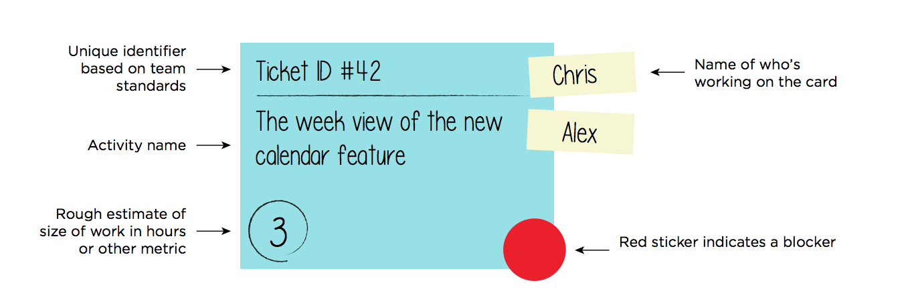

# Exercise: Jeres teams Kanban

På A0 papir og med farvede post-it skal i lave et Kanban Board over de opgave i på nuværende tidspunkt har overblik over skal udføres i jeres Car Wash projekt.

Som udgangspunkt skal i have en TODO, en Doing, og en Done kolonne.    

   

Hvis det giver mening for jer er i velkomne til at udvide med flere kolonner.  

Ud over en overskrift på opgaven skal i også sætte navne på hvem i jeres gruppe der skal udføre opgaven (det må gerne være flere personer).

Det er ikke alle opgaver i på nuværende tidspunkt vil kunne tildele til en bestemt person og de opgave lader i bare være uden navne tilknyttet.

I skal også estimere hvor lang tid hver opgav kommer til at tage. og i skal være opmærksomme på om en opgave er afhængig af en anden eller andre opgaver.    

   

I kommer til at arbejde med denne opgave en times tid fra nu af, og herefter går vi rundt til alle grupper og ser på det Kanban board i har udviklet.
